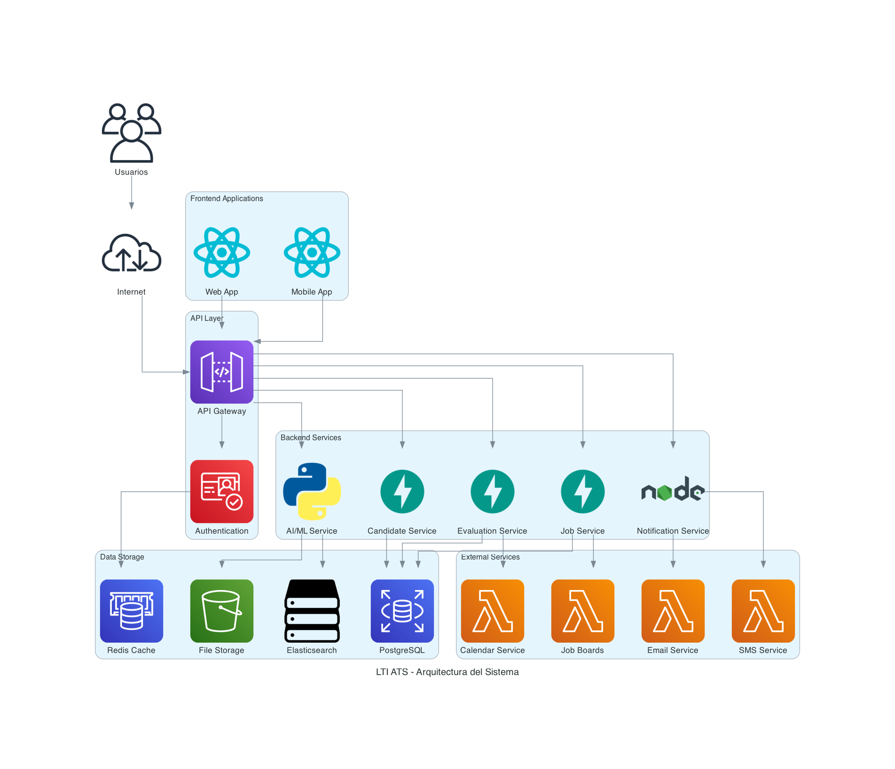

# Sistema ATS para LTI - Documentación Completa

## 1. Descripción del Software ATS para LTI

### 1.1 Visión del Producto
**LTI ATS** es el Applicant Tracking System del futuro, diseñado para revolucionar el proceso de reclutamiento mediante inteligencia artificial, automatización avanzada y una experiencia de usuario excepcional.

### 1.2 Propósito del PRD
Este documento define los requerimientos funcionales y no funcionales para el desarrollo del sistema ATS de LTI, estableciendo las bases para la implementación de un Applicant Tracking System moderno, escalable y centrado en la experiencia del usuario.

### 1.3 Objetivos del Producto
- **Reducir el tiempo de contratación** en un 40%
- **Mejorar la calidad de candidatos** en un 25%
- **Automatizar procesos manuales** con IA
- **Proporcionar insights avanzados** para optimización
- **Crear una experiencia de usuario superior**

---

## 2. Contexto del Producto

### 2.1 Problema que Resuelve
- **Procesos manuales ineficientes** que consumen tiempo valioso
- **Pérdida de candidatos cualificados** por falta de seguimiento
- **Falta de insights** para optimizar procesos de reclutamiento
- **Experiencia fragmentada** entre diferentes herramientas

### 2.2 Oportunidad de Mercado
- Mercado de ATS en crecimiento con CAGR del 6.5%
- Demanda creciente de automatización en HR
- Necesidad de herramientas con IA integrada
- Segmento de startups y empresas medianas desatendido

### 2.3 Propuesta de Valor Única
"El ATS del futuro: IA + UX + Analytics para revolucionar el reclutamiento"

---

## 3. Segmentos de Usuario

### 3.1 Usuarios Principales

#### **Reclutadores (Recruiters)**
- **Perfil**: Profesionales de HR responsables del reclutamiento
- **Necesidades**: Gestión eficiente de vacantes, evaluación de candidatos, comunicación automatizada
- **Pain Points**: Procesos manuales, pérdida de candidatos, falta de insights
- **Objetivos**: Reducir tiempo de contratación, mejorar calidad de candidatos

#### **Hiring Managers**
- **Perfil**: Líderes de equipo que toman decisiones de contratación
- **Necesidades**: Evaluación técnica, decisión final de contratación
- **Pain Points**: Falta de información completa sobre candidatos
- **Objetivos**: Contratar candidatos de alta calidad, optimizar procesos

#### **Administradores del Sistema**
- **Perfil**: Personal técnico y de HR que configura el sistema
- **Necesidades**: Configuración, gestión de usuarios, reportes
- **Pain Points**: Sistemas complejos, falta de flexibilidad
- **Objetivos**: Configurar workflows eficientes, mantener compliance

#### **Candidatos**
- **Perfil**: Personas que aplican a vacantes
- **Necesidades**: Proceso transparente, comunicación clara, seguimiento
- **Pain Points**: Falta de transparencia, comunicación deficiente
- **Objetivos**: Experiencia positiva, feedback oportuno

### 3.2 Segmentos de Cliente
- **Startups** (10-50 empleados): Necesidad de herramientas escalables
- **Empresas medianas** (50-500 empleados): Procesos estandarizados
- **Empresas tech**: Requisitos técnicos específicos

---

## 4. Requerimientos Funcionales

### 4.1 Gestión de Vacantes

#### **RF-001: Creación de Vacantes**
- **Descripción**: El sistema debe permitir crear vacantes con información completa
- **Criterios de Aceptación**:
  - Crear vacante con título, descripción, requisitos, ubicación
  - Definir rango salarial y tipo de contrato
  - Establecer fechas de publicación y cierre
  - Asignar reclutador responsable
- **Prioridad**: Alta
- **Estimación**: 2 semanas

#### **RF-002: Publicación Automática**
- **Descripción**: Publicar vacantes en múltiples portales automáticamente
- **Criterios de Aceptación**:
  - Integración con LinkedIn, Indeed, Glassdoor
  - Personalización de descripción por portal
  - Gestión de estados de publicación
  - Tracking de aplicaciones por fuente
- **Prioridad**: Alta
- **Estimación**: 3 semanas

#### **RF-003: Templates Personalizables**
- **Descripción**: Templates de vacantes por industria y rol
- **Criterios de Aceptación**:
  - Templates predefinidos por industria
  - Personalización de campos obligatorios
  - Reutilización de templates exitosos
- **Prioridad**: Media
- **Estimación**: 1 semana

### 4.2 Captura y Procesamiento de Candidatos

#### **RF-004: Parsing Inteligente de CVs**
- **Descripción**: Extraer datos estructurados de CVs usando IA
- **Criterios de Aceptación**:
  - Procesar CVs en PDF, DOC, DOCX
  - Extraer información personal, experiencia, educación
  - Identificar skills y tecnologías
  - Calcular años de experiencia
- **Prioridad**: Alta
- **Estimación**: 4 semanas

#### **RF-005: Eliminación de Duplicados**
- **Descripción**: Identificar y manejar candidatos duplicados
- **Criterios de Aceptación**:
  - Detectar duplicados por email, teléfono, nombre
  - Fusión automática de perfiles duplicados
  - Notificación al reclutador sobre duplicados
- **Prioridad**: Media
- **Estimación**: 2 semanas

#### **RF-006: Enriquecimiento de Datos**
- **Descripción**: Enriquecer perfiles con datos externos
- **Criterios de Aceptación**:
  - Integración con LinkedIn para datos adicionales
  - Verificación de información de contacto
  - Análisis de presencia online
- **Prioridad**: Baja
- **Estimación**: 3 semanas

### 4.3 Evaluación y Selección

#### **RF-007: Scoring Automático**
- **Descripción**: Asignar scores automáticos a candidatos usando IA
- **Criterios de Aceptación**:
  - Algoritmo de scoring basado en requisitos del puesto
  - Factores: experiencia, skills, educación, match cultural
  - Score de 0-100 con explicación de criterios
  - Aprendizaje continuo del algoritmo
- **Prioridad**: Alta
- **Estimación**: 5 semanas

#### **RF-008: Tests Técnicos Integrados**
- **Descripción**: Integrar tests técnicos en el proceso de evaluación
- **Criterios de Aceptación**:
  - Biblioteca de tests por tecnología/rol
  - Tests automáticos y manuales
  - Evaluación automática de resultados
  - Integración con plataformas externas (HackerRank, etc.)
- **Prioridad**: Alta
- **Estimación**: 4 semanas

#### **RF-009: Evaluaciones de Soft Skills**
- **Descripción**: Evaluar habilidades blandas de candidatos
- **Criterios de Aceptación**:
  - Tests de personalidad integrados
  - Evaluación de competencias culturales
  - Tests de inteligencia emocional
  - Reportes de compatibilidad con equipo
- **Prioridad**: Media
- **Estimación**: 3 semanas

### 4.4 Comunicación y Engagement

#### **RF-010: Emails Automatizados**
- **Descripción**: Enviar emails personalizados automáticamente
- **Criterios de Aceptación**:
  - Templates personalizables por etapa del proceso
  - Personalización con datos del candidato
  - Tracking de apertura y clicks
  - Integración con calendario para seguimiento
- **Prioridad**: Alta
- **Estimación**: 2 semanas

#### **RF-011: Portal del Candidato**
- **Descripción**: Portal para que candidatos sigan su proceso
- **Criterios de Aceptación**:
  - Dashboard personalizado del candidato
  - Estado actual del proceso
  - Documentos requeridos y entregados
  - Calendario de entrevistas
  - Chat con reclutador
- **Prioridad**: Media
- **Estimación**: 4 semanas

#### **RF-012: Notificaciones Push y SMS**
- **Descripción**: Notificaciones en tiempo real
- **Criterios de Aceptación**:
  - Notificaciones push para móvil
  - SMS para actualizaciones críticas
  - Configuración de preferencias por candidato
  - Integración con WhatsApp Business
- **Prioridad**: Baja
- **Estimación**: 3 semanas

### 4.5 Analytics y Reportes

#### **RF-013: Métricas de Tiempo de Contratación**
- **Descripción**: Medir y optimizar tiempo de contratación
- **Criterios de Aceptación**:
  - Dashboard de métricas en tiempo real
  - Análisis por etapa del proceso
  - Comparación con benchmarks de industria
  - Alertas cuando se exceden tiempos objetivo
- **Prioridad**: Alta
- **Estimación**: 2 semanas

#### **RF-014: Análisis de Fuentes de Candidatos**
- **Descripción**: Analizar efectividad de diferentes fuentes
- **Criterios de Aceptación**:
  - ROI por fuente de candidatos
  - Calidad de candidatos por fuente
  - Costo por contratación por fuente
  - Recomendaciones de optimización
- **Prioridad**: Media
- **Estimación**: 2 semanas

#### **RF-015: Reportes de Diversidad e Inclusión**
- **Descripción**: Reportes para garantizar procesos justos
- **Criterios de Aceptación**:
  - Métricas de diversidad por etapa
  - Análisis de sesgos en el proceso
  - Reportes de compliance
  - Recomendaciones para mejorar diversidad
- **Prioridad**: Media
- **Estimación**: 3 semanas

---

## 5. Requerimientos No Funcionales

### 5.1 Rendimiento

#### **RNF-001: Tiempo de Respuesta**
- **Descripción**: El sistema debe responder en menos de 2 segundos
- **Criterios de Aceptación**:
  - Operaciones CRUD: < 1 segundo
  - Búsquedas complejas: < 2 segundos
  - Generación de reportes: < 5 segundos
  - Carga de páginas: < 2 segundos
- **Prioridad**: Alta

#### **RNF-002: Throughput**
- **Descripción**: Soporte para 1000+ usuarios concurrentes
- **Criterios de Aceptación**:
  - 1000 usuarios simultáneos
  - 100,000 operaciones por hora
  - Escalabilidad automática
- **Prioridad**: Alta

#### **RNF-003: Escalabilidad**
- **Descripción**: Capacidad de escalar horizontalmente
- **Criterios de Aceptación**:
  - Auto-scaling basado en carga
  - Soporte para múltiples regiones
  - Balanceo de carga automático
- **Prioridad**: Alta

### 5.2 Disponibilidad

#### **RNF-004: Uptime**
- **Descripción**: 99.9% de disponibilidad
- **Criterios de Aceptación**:
  - Uptime > 99.9% mensual
  - Tiempo de recuperación < 4 horas
  - Backups automáticos diarios
- **Prioridad**: Alta

#### **RNF-005: Disaster Recovery**
- **Descripción**: Recuperación completa en caso de desastre
- **Criterios de Aceptación**:
  - RTO < 4 horas
  - RPO < 1 hora
  - Pruebas de recuperación mensuales
- **Prioridad**: Alta

### 5.3 Seguridad

#### **RNF-006: Autenticación**
- **Descripción**: Autenticación segura con OAuth 2.0 / JWT
- **Criterios de Aceptación**:
  - OAuth 2.0 con proveedores externos
  - JWT tokens con expiración
  - Multi-factor authentication
  - Single Sign-On (SSO)
- **Prioridad**: Alta

#### **RNF-007: Autorización**
- **Descripción**: RBAC (Role-Based Access Control)
- **Criterios de Aceptación**:
  - Roles predefinidos y personalizables
  - Permisos granulares por funcionalidad
  - Auditoría de accesos
  - Principio de menor privilegio
- **Prioridad**: Alta

#### **RNF-008: Encriptación**
- **Descripción**: AES-256 para datos sensibles
- **Criterios de Aceptación**:
  - Encriptación en tránsito (TLS 1.3)
  - Encriptación en reposo (AES-256)
  - Gestión segura de claves
  - Certificados SSL válidos
- **Prioridad**: Alta

#### **RNF-009: Compliance**
- **Descripción**: Cumplimiento con regulaciones de privacidad
- **Criterios de Aceptación**:
  - GDPR compliance
  - CCPA compliance
  - SOX compliance (para empresas públicas)
  - Auditorías regulares
- **Prioridad**: Alta

### 5.4 Usabilidad

#### **RNF-010: Interfaz Responsive**
- **Descripción**: Diseño responsive y accesible
- **Criterios de Aceptación**:
  - Compatible con todos los navegadores modernos
  - Diseño responsive para móviles
  - Accesibilidad WCAG 2.1 AA
  - Soporte para lectores de pantalla
- **Prioridad**: Alta

#### **RNF-011: Mobile-First**
- **Descripción**: Optimizado para dispositivos móviles
- **Criterios de Aceptación**:
  - Aplicación móvil nativa (iOS/Android)
  - Funcionalidad completa en móvil
  - Offline capabilities
  - Push notifications
- **Prioridad**: Media

#### **RNF-012: Curva de Aprendizaje**
- **Descripción**: Curva de aprendizaje < 1 semana
- **Criterios de Aceptación**:
  - Onboarding guiado
  - Tutoriales interactivos
  - Help contextual
  - Documentación completa
- **Prioridad**: Media

---

## 6. Arquitectura del Sistema

### 6.1 Patrón Arquitectónico
- **Microservicios**: Separación por dominio de negocio
- **Event-driven**: Comunicación asíncrona entre servicios
- **API-first**: Diseño centrado en APIs RESTful

### 6.2 Tecnologías Principales
- **Backend**: Python (FastAPI), Node.js
- **Frontend**: React, React Native
- **Base de Datos**: PostgreSQL, Redis, Elasticsearch
- **Cloud**: AWS (ECS, RDS, S3, CloudFront)

### 6.3 Componentes del Sistema

#### **API Gateway**
- **Responsabilidad**: Punto de entrada único, routing, rate limiting
- **Tecnología**: Kong
- **Escalabilidad**: Auto-scaling basado en carga

#### **Servicios de Negocio**
- **Job Service**: Gestión de vacantes y publicaciones
- **Candidate Service**: Gestión de candidatos y CVs
- **Evaluation Service**: Procesos de evaluación y scoring
- **Notification Service**: Comunicación y alertas

#### **Servicios de Infraestructura**
- **Authentication Service**: Gestión de identidad y acceso
- **AI/ML Service**: Procesamiento inteligente y analytics
- **File Service**: Gestión de archivos y documentos

---

## 7. Plan de Implementación

### 7.1 Fase 1: MVP (3 meses)
**Objetivo**: Funcionalidades básicas de ATS

#### **Sprint 1-2: Fundación**
- Autenticación y autorización
- Gestión básica de usuarios y organizaciones
- Configuración del sistema

#### **Sprint 3-4: Gestión de Vacantes**
- Creación y edición de vacantes
- Publicación básica en portales
- Templates de vacantes

#### **Sprint 5-6: Captura de Candidatos**
- Aplicación a vacantes
- Subida y almacenamiento de CVs
- Gestión básica de candidatos

#### **Sprint 7-8: Evaluación Básica**
- Estados del proceso de reclutamiento
- Comentarios y notas
- Asignación de candidatos

#### **Sprint 9-10: Comunicación**
- Emails automáticos básicos
- Notificaciones del sistema
- Portal básico del candidato

#### **Sprint 11-12: Reportes Básicos**
- Dashboard de métricas
- Reportes de actividad
- Exportación de datos

### 7.2 Fase 2: IA Integration (2 meses)
**Objetivo**: Integración de inteligencia artificial

#### **Sprint 13-14: Parsing de CVs**
- Parsing inteligente de CVs
- Extracción de datos estructurados
- Eliminación de duplicados

#### **Sprint 15-16: Scoring Automático**
- Algoritmo de scoring básico
- Evaluación automática de candidatos
- Recomendaciones de matching

#### **Sprint 17-18: Analytics Básicos**
- Métricas de tiempo de contratación
- Análisis de fuentes de candidatos
- Insights básicos

### 7.3 Fase 3: Advanced Features (3 meses)
**Objetivo**: Funcionalidades avanzadas

#### **Sprint 19-20: Tests Técnicos**
- Integración con plataformas de tests
- Tests automáticos y manuales
- Evaluación de resultados

#### **Sprint 21-22: Comunicación Avanzada**
- Portal completo del candidato
- Chat integrado
- Notificaciones push y SMS

#### **Sprint 23-24: Mobile App**
- Aplicación móvil nativa
- Funcionalidades offline
- Push notifications

#### **Sprint 25-26: Analytics Avanzados**
- Reportes de diversidad
- Analytics predictivos
- Insights avanzados

### 7.4 Fase 4: Enterprise Features (2 meses)
**Objetivo**: Funcionalidades enterprise

#### **Sprint 27-28: Multi-tenant**
- Arquitectura multi-tenant
- Configuración por organización
- Aislamiento de datos

#### **Sprint 29-30: Compliance Avanzado**
- Compliance GDPR/CCPA
- Auditorías automáticas
- Reportes de compliance

#### **Sprint 31-32: Integraciones Enterprise**
- Integración con HRIS
- APIs para sistemas externos
- Webhooks personalizables

---

## 8. Métricas de Éxito

### 8.1 Métricas Técnicas
- **Tiempo de respuesta**: < 2 segundos
- **Uptime**: > 99.9%
- **Cobertura de tests**: > 80%
- **Tiempo de deployment**: < 30 minutos

### 8.2 Métricas de Negocio
- **Reducción del tiempo de contratación**: 40%
- **Mejora en la calidad de candidatos**: 25%
- **ROI positivo**: 18 meses
- **Tasa de adopción**: > 80%

### 8.3 Métricas de Usuario
- **Satisfacción del usuario**: > 4.5/5
- **Tiempo de onboarding**: < 1 semana
- **Reducción de tickets de soporte**: 50%
- **Retención de usuarios**: > 90%

---

## 9. Riesgos y Mitigaciones

### 9.1 Riesgos Técnicos

#### **Riesgo: Complejidad de IA**
- **Probabilidad**: Media
- **Impacto**: Alto
- **Mitigación**: Desarrollo iterativo con modelos pre-entrenados
- **Plan B**: Funcionalidades manuales como fallback

#### **Riesgo: Escalabilidad**
- **Probabilidad**: Baja
- **Impacto**: Alto
- **Mitigación**: Arquitectura de microservicios desde el inicio
- **Plan B**: Optimización de consultas y caching

#### **Riesgo: Seguridad**
- **Probabilidad**: Baja
- **Impacto**: Crítico
- **Mitigación**: Compliance por diseño, auditorías regulares
- **Plan B**: Encriptación end-to-end, backups seguros

### 9.2 Riesgos de Negocio

#### **Riesgo: Adopción de Usuarios**
- **Probabilidad**: Media
- **Impacto**: Alto
- **Mitigación**: UX/UI centrado en usuario, onboarding guiado
- **Plan B**: Integración con sistemas existentes

#### **Riesgo: Competencia**
- **Probabilidad**: Alta
- **Impacto**: Medio
- **Mitigación**: Diferenciación por IA y UX
- **Plan B**: Precios competitivos, features únicas

#### **Riesgo: Cambios en el Mercado**
- **Probabilidad**: Baja
- **Impacto**: Alto
- **Mitigación**: Arquitectura flexible, desarrollo ágil
- **Plan B**: Pivot rápido basado en feedback

---

## 10. Criterios de Aceptación

### 10.1 Criterios Generales
- [ ] Sistema funcional con todas las features MVP
- [ ] Performance dentro de los parámetros definidos
- [ ] Seguridad implementada según estándares
- [ ] Usabilidad validada con usuarios reales
- [ ] Documentación completa y actualizada

### 10.2 Criterios por Fase

#### **Fase 1: MVP**
- [ ] Autenticación y autorización funcionando
- [ ] Gestión básica de vacantes y candidatos
- [ ] Comunicación básica implementada
- [ ] Reportes básicos generándose

#### **Fase 2: IA Integration**
- [ ] Parsing de CVs funcionando
- [ ] Scoring automático implementado
- [ ] Analytics básicos operativos

#### **Fase 3: Advanced Features**
- [ ] Tests técnicos integrados
- [ ] Portal del candidato completo
- [ ] Mobile app publicada

#### **Fase 4: Enterprise Features**
- [ ] Multi-tenant implementado
- [ ] Compliance validado
- [ ] Integraciones enterprise funcionando

---

## 11. Anexos

### 11.1 Glosario de Términos
- **ATS**: Applicant Tracking System
- **CV**: Curriculum Vitae
- **HRIS**: Human Resources Information System
- **ROI**: Return on Investment
- **SLA**: Service Level Agreement
- **Uptime**: Tiempo de disponibilidad del sistema

### 11.2 Referencias
- Documentación técnica detallada en LTI-JCGA.md
- Lean Canvas del modelo de negocio
- Diagramas de arquitectura y casos de uso
- Investigación de mercado en ats-research.md

### 11.3 Contactos
- **Product Manager**: [Por definir]
- **Technical Lead**: [Por definir]
- **UX/UI Lead**: [Por definir]
- **QA Lead**: [Por definir]

---

## 2. Lean Canvas - Modelo de Negocio


### Descripción del Lean Canvas para LTI ATS

El Lean Canvas generado incluye todos los elementos clave del modelo de negocio:

#### **PROBLEMA**
- Procesos manuales ineficientes
- Pérdida de candidatos cualificados
- Falta de insights para optimizar

#### **SOLUCIÓN**
- Automatización con IA
- Matching inteligente
- Analytics predictivos

#### **PROPOSICIÓN DE VALOR ÚNICA**
"El ATS del futuro: IA + UX + Analytics para revolucionar el reclutamiento"

#### **VENTAJA ESPECIAL**
- Algoritmos de IA propietarios
- UX superior intuitiva
- Arquitectura modular escalable

#### **SEGMENTO DE CLIENTES**
- Startups (10-50 empleados)
- Empresas medianas (50-500)
- Empresas tech

#### **MÉTRICAS CLAVE**
- Tiempo de contratación
- Costo por contratación
- Calidad de candidatos
- Retención de candidatos

#### **CANALES**
- Marketing digital
- Partnerships
- Referencias
- Eventos tech

#### **ESTRUCTURA DE COSTES**
- Desarrollo de IA
- Infraestructura cloud
- Equipo de desarrollo
- Marketing y ventas

#### **FLUJO DE INGRESOS**
- Suscripción mensual
- Pago por uso
- Servicios profesionales
- Marketplace de integraciones

## 3. UML de Secuencia Principales

### Secuencia 1: Publicación y Captura de Candidatos

**Actores:** Reclutador, Sistema ATS, Portales de Empleo


### Secuencia 2: Evaluación y Selección de Candidatos

**Actores:** Reclutador, Candidato, Evaluador Técnico, Sistema ATS


### Secuencia 3: Gestión del Proceso de Contratación

**Actores:** Reclutador, Candidato, Hiring Manager, Sistema ATS


## 3.1 Diagramas UML de Caso de Uso

### Diagrama UML de Caso de Uso 1: Gestión de Vacantes y Candidatos


### Diagrama UML de Caso de Uso 2: Evaluación y Selección


### Diagrama UML de Caso de Uso 3: Proceso de Contratación


### Roles de Usuario del Sistema

#### **Reclutador (Recruiter)**
- **Responsabilidades:** Gestión de vacantes, evaluación inicial, comunicación con candidatos
- **Permisos:** Crear/editar vacantes, revisar candidatos, programar entrevistas
- **KPIs:** Tiempo de contratación, calidad de candidatos

#### **Hiring Manager**
- **Responsabilidades:** Evaluación técnica, decisión final de contratación
- **Permisos:** Revisar candidatos evaluados, aprobar contrataciones
- **KPIs:** Calidad de contrataciones, retención

#### **Administrador del Sistema**
- **Responsabilidades:** Configuración del sistema, gestión de usuarios, reportes
- **Permisos:** Acceso completo al sistema, configuración de workflows
- **KPIs:** Uso del sistema, satisfacción de usuarios

#### **Candidato**
- **Responsabilidades:** Aplicar a vacantes, completar evaluaciones, seguir proceso
- **Permisos:** Acceso limitado al portal del candidato
- **KPIs:** Experiencia del candidato, tasa de conversión

## 4. Modelo de Datos (ERD)


## 5. Diagrama C4 - Nivel 2: Contenedores


## 6. Código Python para Diagrama de Arquitectura

```python
from diagrams import Diagram, Cluster
from diagrams.aws.compute import Lambda
from diagrams.aws.database import RDS, ElastiCache
from diagrams.aws.storage import S3
from diagrams.aws.network import APIGateway
from diagrams.aws.security import Cognito
from diagrams.onprem.client import Users
from diagrams.onprem.network import Internet
from diagrams.programming.framework import React, FastAPI
from diagrams.programming.language import Python, NodeJS
from diagrams.generic.database import PostgreSQL
from diagrams.generic.storage import Storage

def create_ats_architecture():
    with Diagram("LTI ATS - Arquitectura del Sistema", show=False, direction="TB"):
        
        # External users and internet
        users = Users("Usuarios")
        internet = Internet("Internet")
        
        # Frontend applications
        with Cluster("Frontend Applications"):
            web_app = React("Web App")
            mobile_app = React("Mobile App")
        
        # API Gateway and Authentication
        with Cluster("API Layer"):
            api_gateway = APIGateway("API Gateway")
            auth_service = Cognito("Authentication")
        
        # Backend Services
        with Cluster("Backend Services"):
            job_service = FastAPI("Job Service")
            candidate_service = FastAPI("Candidate Service")
            evaluation_service = FastAPI("Evaluation Service")
            notification_service = NodeJS("Notification Service")
            ai_service = Python("AI/ML Service")
        
        # Data Storage
        with Cluster("Data Storage"):
            postgres = PostgreSQL("PostgreSQL")
            redis_cache = ElastiCache("Redis Cache")
            elasticsearch = Storage("Elasticsearch")
            s3_storage = S3("File Storage")
        
        # External Services
        with Cluster("External Services"):
            email_service = Lambda("Email Service")
            sms_service = Lambda("SMS Service")
            calendar_service = Lambda("Calendar Service")
            job_boards = Lambda("Job Boards")
        
        # Connections
        users >> internet
        internet >> api_gateway
        web_app >> api_gateway
        mobile_app >> api_gateway
        
        api_gateway >> auth_service
        api_gateway >> job_service
        api_gateway >> candidate_service
        api_gateway >> evaluation_service
        api_gateway >> notification_service
        api_gateway >> ai_service
        
        job_service >> postgres
        candidate_service >> postgres
        evaluation_service >> postgres
        auth_service >> redis_cache
        ai_service >> elasticsearch
        ai_service >> s3_storage
        
        notification_service >> email_service
        notification_service >> sms_service
        job_service >> job_boards
        evaluation_service >> calendar_service

if __name__ == "__main__":
    create_ats_architecture()
```



Version Simplificada


### Explicación del Código Python

El código utiliza la librería `diagrams` para crear un diagrama de arquitectura que muestra:

1. **Frontend Applications**: Aplicaciones web y móvil que consumen la API
2. **API Layer**: Gateway y autenticación como punto de entrada
3. **Backend Services**: Microservicios especializados en diferentes funcionalidades
4. **Data Storage**: Diferentes tipos de almacenamiento según el uso
5. **External Services**: Servicios externos para funcionalidades específicas

**Características del diseño:**
- **Arquitectura de microservicios** para escalabilidad
- **Separación de responsabilidades** clara
- **Múltiples tipos de almacenamiento** optimizados por uso
- **Integración con servicios externos** para funcionalidades especializadas

## 7. Documento ARD (Architecture Requirements Document)

### 7.1 Introducción

**Propósito del Documento**
Este documento define los requerimientos de arquitectura para el sistema ATS de LTI, estableciendo las bases técnicas para el desarrollo de un Applicant Tracking System moderno y escalable.

**Alcance**
El sistema ATS de LTI debe soportar el ciclo completo de reclutamiento, desde la publicación de vacantes hasta la contratación, con capacidades de IA integradas.

### 7.2 Requerimientos Funcionales

#### RF-001: Gestión de Vacantes
- El sistema debe permitir crear, editar y publicar vacantes
- Debe soportar publicación automática en múltiples portales
- Debe permitir personalización de descripciones por canal

#### RF-002: Captura de Candidatos
- El sistema debe procesar automáticamente CVs enviados
- Debe extraer datos estructurados usando IA
- Debe eliminar duplicados automáticamente

#### RF-003: Evaluación Inteligente
- El sistema debe asignar scores automáticos a candidatos
- Debe integrar tests técnicos y evaluaciones
- Debe proporcionar insights basados en IA

#### RF-004: Comunicación Automatizada
- El sistema debe enviar emails automáticos personalizados
- Debe proporcionar portal de seguimiento para candidatos
- Debe soportar notificaciones push y SMS

### 7.3 Requerimientos No Funcionales

#### RNF-001: Rendimiento
- **Tiempo de respuesta**: < 2 segundos para operaciones CRUD
- **Throughput**: Soporte para 1000+ usuarios concurrentes
- **Escalabilidad**: Capacidad de escalar horizontalmente

#### RNF-002: Disponibilidad
- **Uptime**: 99.9% de disponibilidad
- **Recovery Time**: < 4 horas para recuperación completa
- **Backup**: Backups automáticos diarios

#### RNF-003: Seguridad
- **Autenticación**: OAuth 2.0 / JWT
- **Autorización**: RBAC (Role-Based Access Control)
- **Encriptación**: AES-256 para datos sensibles
- **Compliance**: GDPR, CCPA, SOX

#### RNF-004: Usabilidad
- **Interfaz**: Diseño responsive y accesible
- **Mobile-first**: Optimizado para dispositivos móviles
- **Intuitividad**: Curva de aprendizaje < 1 semana

### 7.4 Arquitectura del Sistema

#### 7.4.1 Patrón Arquitectónico
- **Microservicios**: Separación por dominio de negocio
- **Event-driven**: Comunicación asíncrona entre servicios
- **API-first**: Diseño centrado en APIs RESTful

#### 7.4.2 Tecnologías Principales
- **Backend**: Python (FastAPI), Node.js
- **Frontend**: React, React Native
- **Base de Datos**: PostgreSQL, Redis, Elasticsearch
- **Cloud**: AWS (ECS, RDS, S3, CloudFront)

#### 7.4.3 Componentes del Sistema

**API Gateway**
- **Responsabilidad**: Punto de entrada único, routing, rate limiting
- **Tecnología**: Kong
- **Escalabilidad**: Auto-scaling basado en carga

**Servicios de Negocio**
- **Job Service**: Gestión de vacantes y publicaciones
- **Candidate Service**: Gestión de candidatos y CVs
- **Evaluation Service**: Procesos de evaluación y scoring
- **Notification Service**: Comunicación y alertas

**Servicios de Infraestructura**
- **Authentication Service**: Gestión de identidad y acceso
- **AI/ML Service**: Procesamiento inteligente y analytics
- **File Service**: Gestión de archivos y documentos

### 7.5 Consideraciones de Diseño

#### 7.5.1 Escalabilidad
- **Horizontal**: Microservicios independientes
- **Vertical**: Recursos configurables por servicio
- **Database**: Sharding y replicación

#### 7.5.2 Resiliencia
- **Circuit Breaker**: Protección contra fallos en cascada
- **Retry Logic**: Reintentos automáticos con backoff
- **Graceful Degradation**: Funcionalidad limitada en caso de fallos

#### 7.5.3 Observabilidad
- **Logging**: Logs estructurados con correlación
- **Monitoring**: Métricas en tiempo real
- **Tracing**: Distributed tracing para debugging

### 7.6 Plan de Implementación

#### Fase 1: MVP (3 meses)
- Funcionalidades básicas de ATS
- Autenticación y autorización
- Gestión de vacantes y candidatos

#### Fase 2: IA Integration (2 meses)
- Parsing inteligente de CVs
- Scoring automático de candidatos
- Analytics básicos

#### Fase 3: Advanced Features (3 meses)
- Evaluaciones técnicas integradas
- Comunicación automatizada
- Mobile app

#### Fase 4: Enterprise Features (2 meses)
- Multi-tenant
- Compliance avanzado
- Integraciones enterprise

### 7.7 Riesgos y Mitigaciones

#### Riesgo Técnico: Complejidad de IA
- **Mitigación**: Desarrollo iterativo con modelos pre-entrenados
- **Plan B**: Funcionalidades manuales como fallback

#### Riesgo de Negocio: Adopción de Usuarios
- **Mitigación**: UX/UI centrado en usuario, onboarding guiado
- **Plan B**: Integración con sistemas existentes

#### Riesgo de Seguridad: Datos Sensibles
- **Mitigación**: Encriptación end-to-end, auditorías regulares
- **Plan B**: Compliance por diseño desde el inicio

### 7.8 Criterios de Éxito

#### Técnicos
- Tiempo de respuesta < 2 segundos
- Uptime > 99.9%
- Cobertura de tests > 80%

#### Negocio
- Reducción del tiempo de contratación en 40%
- Mejora en la calidad de candidatos del 25%
- ROI positivo en 18 meses

#### Usuario
- Satisfacción del usuario > 4.5/5
- Tasa de adopción > 80%
- Reducción de tickets de soporte en 50%
